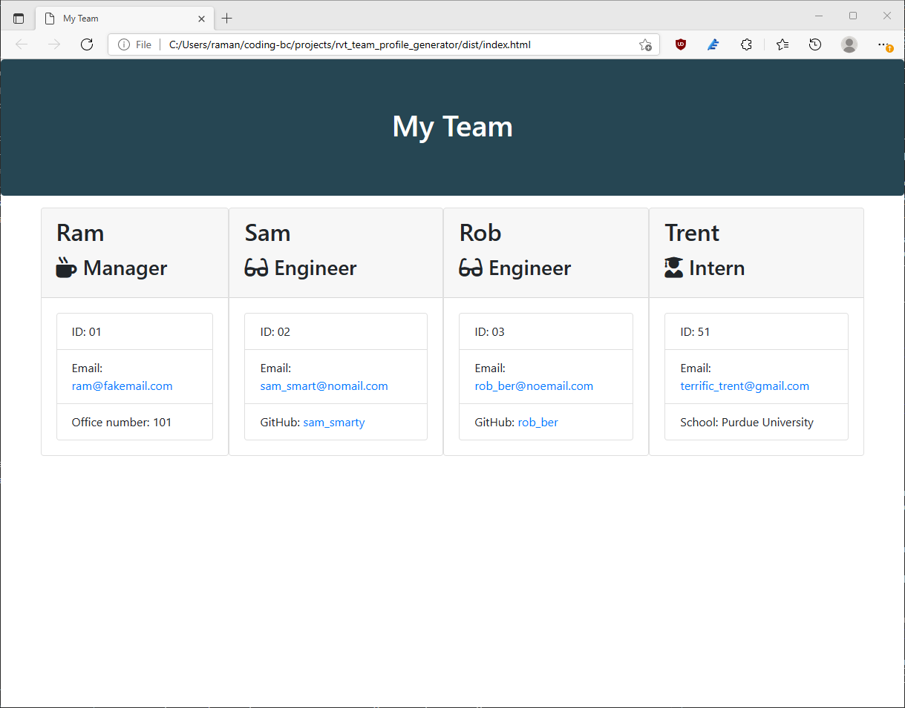

# Team Profile Generator 
> A command line application that takes user input and generates an HTML page containing the profile of a software engineering team

## Table of contents
  - [General info](#general-info)
  - [Screenshots](#screenshots)
  - [Video Demo](#video-demo)
  - [Licenses](#licenses)
  - [Setup](#setup)
  - [Code](#code)
  - [Developer(s)](#developers)

## General info
This application will create a software engineering team's profile with all team members names and basic employee details including email addresses and links to their Github profiles. User will enter the manager's information first, then enter the details of all other team members including all engineers and interns. The application is written using JavaScript and should be run using the Node.js JavaScript runtime environment. The NPM inquirer package is used to provide the command line interface to gather user input, and the jest package is used to validate classes.

## Screenshots

## Video Demo
[Team Portfolio Demo](https://www.youtube.com/watch?v=ZMrtMJ6bMuM)

## Licenses
 
 

## Setup
* run these commands in order:
   1. npm install
   2. node index.js

## Code
* HTML/CSS
* JavaScript
* Bootstrap
* Node.js
* Jest
* Inquirer
* fs

## Developer(s)
* Raman TV.
